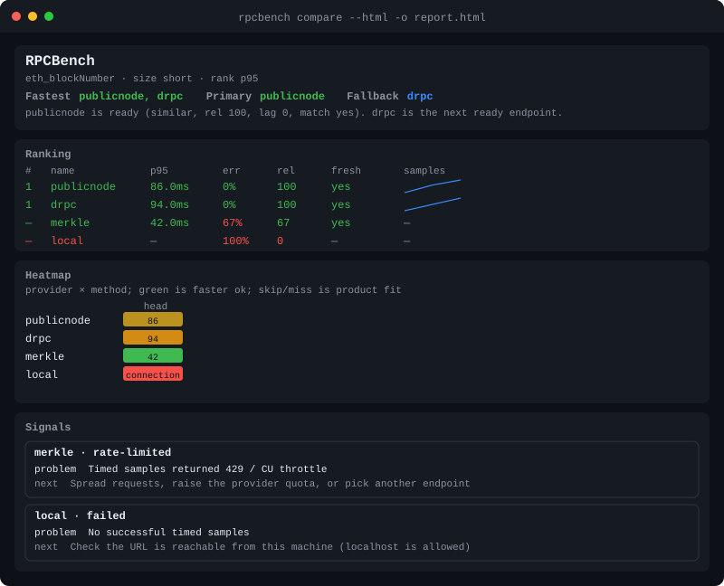
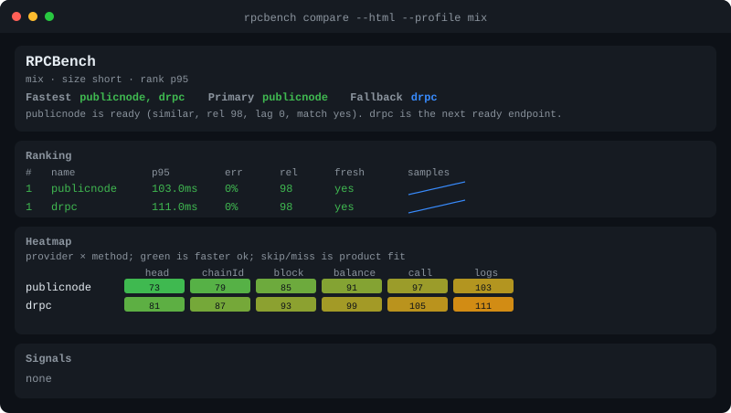

# RPCBench

**Which RPC endpoint is fastest — for this call, from this machine?**

A small CLI that compares **EVM JSON-RPC over HTTP**: latency, P50/P95/P99, error rate, a ranked table, and JSON. Read-only by default. No accounts. No telemetry. Localhost and RFC1918 are allowed (that is how you bench your own node).

It is **not** a security scanner ([Nodeprobe](https://github.com/ehsanhajian/nodeprobe)) and **not** validator monitoring ([ValidatorPulse](https://github.com/ehsanhajian/ValidatorPulse)). Split: [docs/BOUNDARY.md](https://github.com/ehsanhajian/RPCBench/blob/main/docs/BOUNDARY.md). How the numbers are computed: [docs/METHODOLOGY.md](https://github.com/ehsanhajian/RPCBench/blob/main/docs/METHODOLOGY.md). Roadmap: [issues](https://github.com/ehsanhajian/RPCBench/issues) · epic [#19](https://github.com/ehsanhajian/RPCBench/issues/19).

## Install

```bash
pip install rpcbench
```

Python 3.10+. `rpcbench --version` prints `0.3.0`.

```bash
python3 -m venv .venv
source .venv/bin/activate
pip install -e ".[dev]"
```

PRs run `pytest`, then a live smoke against PublicNode and dRPC (`--samples 1 --warmup 0`). No local node in CI; the smoke passes if either public endpoint is ok.

## Start

```bash
rpcbench compare --endpoints https://ethereum.publicnode.com --budget short
rpcbench compare --endpoints endpoints.yaml --profile mix --budget short
rpcbench compare --endpoints endpoints.yaml --profile mix --budget short --json
```

Or a YAML/JSON file of named endpoints (keep API keys in a **local** file; do not commit it):

```yaml
endpoints:
  - name: publicnode
    url: https://ethereum.publicnode.com
  - name: drpc
    url: https://eth.drpc.org
  - name: paid
    url: https://eth.example/v3/YOUR_KEY
    bearer: YOUR_TOKEN
    headers:
      X-Api-Key: YOUR_KEY
```

```bash
rpcbench run --endpoints endpoints.yaml
rpcbench compare --endpoints endpoints.yaml --json
rpcbench run --endpoints endpoints.yaml -o report.json
rpcbench compare --endpoints endpoints.yaml --html -o report.html
rpcbench compare --endpoints endpoints.yaml --md
rpcbench compare --endpoints endpoints.yaml --csv -o report.csv
rpcbench diff old.json new.json
```

`run` and `compare` are the same command.

## Report

Default is Fastest, a production-readiness **Verdict**, a **Route** (primary / fallback), and the ranked list. `--verbose` is the full dump (including **Signals**). `--json` / `-o` is always the complete payload. `--html -o report.html` is a standalone file (inline CSS/SVG, no CDN): ranking with sample sparklines, a provider × method **Heatmap**, **Signals** (problem / why / next), and print CSS. `--md` is a pasteable GitHub markdown table with aligned columns (ranking, P95, errors, rel, freshness, verdict). `--csv` is one flat row per provider (run, rank, latency, verdict, transport). `-o report.csv` writes that CSV and keeps the CLI table. `rpcbench diff old.json new.json` compares two JSON runs (P95 delta, winner change, new signals) and exits 1 in CI if the previous **primary** got worse beyond the similar-band. `--history DIR` appends a JSON snapshot after a run so diff can use `--history DIR`. Every report prints a **Cite** line (version, git sha, family, vantage, UTC) so the numbers can be reproduced.

**Default**


**`--profile mix`** (Coverage table: which required methods succeeded)

```bash
rpcbench compare --endpoints endpoints.yaml --profile mix --budget short
```


**HTTP timing** (`--new-connection --verbose`)


**`--verbose`**


**HTML report** (`--html -o report.html`) — colored ranking, heatmap, and signals table; works offline; print-ready



**`--profile mix` heatmap** (provider × method; skip/miss is product fit, not a scan)



The default CLI prints, in order:

1. **Summary** — Fastest (P95 by default; similar-band co-winners, not 81ms vs 84ms)
2. **Verdict** — production-ready / risky / not ready for this workload, this run. Labels: `fast+stable`, `slow+reliable`, `similar`, `stale`, `stale-risk`, `timeout`, `rate-limited`, `coverage`, `disagree`, `jitter`, `failed`, `errors`. Not an SLA.
3. **Route** — **primary** and **fallback** among ready endpoints. Stale or disagreeing nodes are never primary. Fallback prefers a different error class (not two 429s). Named when 2+ providers are ready; otherwise fallback is `none`. One paragraph explains the choice.
4. **Ranking** — one table, ordered by `--rank-by`; similar share a place; high error, stale, or disagree is `~`; failed last. **`rel`** is the 0–100 reliability score for this run.
5. **Notes** — one line per endpoint that hit `rate_limit` on timed samples or tags (`merkle  rate_limit=2  tags=2`)
6. **Batch** — when `--batch` is set: support, batch vs serial wall-clock, ratio. `skip` means the extra read did not run (`budget` / `duration`). Not mixed into ranking.

`--verbose` adds the rest (same numbers, no data loss):

7. **Comparison** — YAML order (failed rows stay in place; head / lag / fresh / hash / match; **rel**)
8. **Reliability** — breakdown of `rel` (errors, timeouts, tail, mix coverage). Not an SLA. Not a security score.
9. **Signals** — each problem / why / next (routing and config: raise `--timeout`, pick another endpoint, pin `--block`). Not CVE language, not hardening.
10. **Coverage** — active mix only: each required method is `ok`, an error class, or `skip` if not offered. A miss is product fit (indexer `eth_getLogs` 404s), not a vuln. Compact `--profile mix` prints this table; JSON is `coverage`.
11. **Methods** — per-method P50/P95/P99 and errors when `--profile mix` (ranking still uses the whole mix)
12. **Timing** — handshake (DNS+TCP+TLS) vs server wait vs payload (body+parse). Not mixed into ranking. Default is keep-alive; `--new-connection` is a cold handshake every request
13. **Transport** — negotiated HTTP proto (`1.1` / `2`), content-encoding, request/response bytes. Size vs latency is in HTML. Not mixed into ranking. `--http2` asks for HTTP/2; `--http1` forces 1.1
14. **Tags** — one paired `latest` / `safe` / `finalized` snapshot (skipped with a reason if the tag is missing)
15. **Burst** — burst vs steady error rate and recovered rps when `--burst` is set (same request budget). Extra tag 429s show as `tags=N`, not in timed `n`/`err`.
16. **Providers** — one table: redacted URL, client, n/err, p95, head/lag/fresh/match, histogram (`≥1s=3`), note. Per-sample rows follow.
17. **Capabilities** — who answered this method (and whether batch was supported, when enabled)

On a TTY, ok is green and fail is red (`NO_COLOR` or a pipe turns color off). Reports never print API keys, bearer tokens, or header values.

## How a run works

Numbers and caveats: [docs/METHODOLOGY.md](docs/METHODOLOGY.md).

### Workload

- **Paired by default:** one shared read-only sequence; each sample is raced to every provider at the same time. `--sequential` is A-then-B.
- **`--budget`** picks a named size (`short` / `standard` / `long`). That sets how many samples to take. **`--max-requests`** is the HTTP cap (how many requests the run may send). `--samples` and `--warmup` override the named size. `long` is more samples only — not archive, WebSocket, or tracing unless the workload asks.
- **`--profile mix`** runs a documented read-only mix (head, chainId, getBlockByNumber latest, getBalance of the zero address, eth_call of empty data to the zero address, getLogs latest→latest on the zero address). `--samples` is per method. Ranking uses the whole mix, not one cheap head read. **Coverage** is those methods only: `ok`, error class, or `skip` if not offered. A failing `eth_getLogs` is a miss for an indexer, not a vuln. Payloads: [docs/METHODOLOGY.md](docs/METHODOLOGY.md).
- **Burst** is opt-in (`--burst N`, max 8). The first N timed samples overlap; the rest are a steady phase, optionally capped with `--rps`. Burst splits the existing sample budget and does not add requests. Burst vs steady error rate and rps are reported separately. Tag 429s are `tags=N` on that table (not mixed into timed n/err). Default is off (`--burst 0`, `--rps 0`). Ramp/spike/soak shapes are a later issue.
- **Batch** is opt-in (`--batch N`, omit N for 3, max 8). After timed samples, RPCBench sends one JSON-RPC array of N copies of the primary method, then the same N calls one-by-one, and reports wall-clock and the serial/batch ratio. A single-object error means the provider does not support batch (capability, not a crash). Partial item errors are marked `partial`. Adds 1+N requests per endpoint. Default is off (`--batch 0`). Not HTTP/2 multiplexing.

### Stats

- **Warmup is excluded** from min/mean/max, jitter, percentiles, error rate, and the histogram.
- **P50/P95/P99** are nearest-rank over successful samples. **Jitter** is the sample standard deviation of those samples (needs n≥2). **P99** is the slowest sample until n≥100 (flagged below that).
- **Histogram** is where successes landed: empty buckets are omitted (`≥1s=3`, or `<50ms=8  ≥1s=8` when split). Buckets: `<50ms`, `<100ms`, `<250ms`, `<1s`, `≥1s` (same edges in JSON).
- **HTTP timing** splits each successful sample into handshake (DNS+TCP+TLS), server wait after the connection is ready, and payload (body download + JSON parse). Ranking still uses total RTT. Default reuses keep-alive connections (handshake is ~0 after warmup). `--new-connection` opens a fresh TCP/TLS session every request so distance vs node time is visible. TLS here is handshake latency, not a certificate check.
- **HTTP transport** records the negotiated protocol (`1.1` or `2`), `Content-Encoding` (`gzip`, `br`, …), request bytes, and response wire bytes. Huge `eth_getLogs` payloads and missing compression look like slow nodes. Ranking still uses total RTT. Default is HTTP/1.1. `--http2` asks for HTTP/2 via ALPN (falls back to 1.1). `--http1` forces HTTP/1.1. Not a TLS or CORS check.
- **Error rate** is failed/attempted, with a class (timeout, connection, HTTP 4xx/5xx, **rate_limit**, JSON-RPC, malformed). `rate_limit` is HTTP 429 or a CU/throttle JSON-RPC message — reliability, not a scan.
- **rps** in the table is `1000 / mean_ms` for this probe — not parallel throughput. `--rps N` is a start cap after `--burst`, not that formula.
- **Reliability `rel`** is 0–100 for **this run** (not an SLA, not a security score). Same samples always produce the same score:

  `rel = round( 50×(1−error_rate) + 20×(1−timeout_share) + 20×(1−tail) + 10×coverage )`

  `timeout_share` is timeouts / attempted. `tail` is 0 when P99=P50 and 1 when P99/P50 ≥ 3. `coverage` is the fraction of mix steps with at least one success (1.0 for a single method that answered). A 100% error run is **0**. A clean run with a flat tail is **100**. `--verbose` prints the four parts. JSON is `reliability` (score plus breakdown).

### Ranking

- Default is P95 of successes (over the mix when `--profile mix`). Override with `--rank-by p50|p95|p99|mean|rps` (`throughput` = `rps`). Lower latency wins; higher rps wins.
- **Similar-band** (default 10%) shares a place when the worse value is within that fraction of the better. Error rate above the same band, a **stale** head, a **disagreeing** block hash, or a **coverage miss** (a required mix step never succeeded) is not a numbered place (`~`). Failed (`n_ok=0`) never take Fastest.
- **Route** names a **primary** and **fallback** among **ready** endpoints (never stale or disagree). Primary is the best reliability score within the similar-band of the fastest ready node, preferring known freshness and a matching hash. Fallback is the next ready endpoint; if primary had a timed error class, fallback skips others with that same class when a diverse ready alternative exists. One paragraph in the compact CLI explains the choice. JSON is `route`.

### Extra reads

These are not mixed into latency stats or Fastest.

- **Freshness** is lag vs the cohort’s upper-median `eth_blockNumber` in the same window. Default `--stale-blocks 2`. Tables print **yes** when lag is within that tolerance, **stale** when it exceeds it (Ranking note may add `~Ns`). Lag time uses `--block-time` or a known chain from `eth_chainId` already in the mix (12s on Ethereum). Extra head reads happen only when the workload has no `eth_blockNumber`. JSON still uses `fresh` / `stale`.
- **Consistency** is whether providers return the same block **hash** at one pinned height (default: that cohort median). `--block HEX|N` pins the check when heads naturally diverge by one block. A unique majority hash is canonical; a split is disagreement for everyone who returned a hash. Tables print **yes** / **no** under match. Missing/unparseable hashes are unknown, not disagree. JSON still uses `agree` / `disagree`. Not fork choice and not a security finding.
- **Client** is a volunteered `web3_clientVersion` string stored as a label (Erigon vs Geth). Missing or hex-only results are omitted. Not a disclosure finding, not outdated-client recon, not a CVE check.
- **Tags** are one paired `eth_getBlockByNumber` snapshot each for `latest`, `safe`, and `finalized`. Latency and freshness are per tag vs that tag’s cohort. Unsupported tags are skipped with a reason and do not change Fastest. Full P95 of one tag is `--method eth_getBlockByNumber --params '["finalized", false]'`.
- **Batch** is one JSON-RPC array of N calls vs the same N sent serially (`--batch N`). Wall-clock and ratio are extra reads. Unsupported batch is `batch_unsupported`; partial item errors are `partial`. Not mixed into Fastest.

### JSON

`--json` or `-o FILE` includes `mode`, `seed`, `sequence_id`, `connection` (`keepalive` or `new`), `http` (`1.1` or `2`), a `watermark` (version, git sha, UTC, budget, workload, seed, family, vantage, sample counts, plus [methodology](docs/METHODOLOGY.md) and [boundary](docs/BOUNDARY.md) URLs), `coverage` (active mix steps only), `reliability` (0–100 this-run score plus breakdown; not success rate alone), `verdict` (ready / risky / not_ready plus `kind` and problem/why/next `signals`), `route` (primary / fallback / why), per-provider `id` (URL fingerprint, not printed in the CLI table), per-sample `pairs` (body hashes), `jitter_ms`, `histogram`, `freshness`, `consistency`, `client`, `tags`, `burst`, `batch` (size, supported, wall-clock vs serial), HTTP `timing` percentiles, `transport` (proto, encoding, bytes), and burst `phases`.

`--md` is that ranking as GitHub-flavored markdown with aligned columns (not the full JSON). `--csv` is one row per provider, columns grouped run → rank → latency → verdict → transport → batch (not per-sample rows). `rpcbench diff` reads two of these JSON files. Not a security finding.

## Flags

```bash
rpcbench run --endpoints endpoints.yaml --budget short
rpcbench run --endpoints endpoints.yaml --profile mix --budget short
rpcbench run --endpoints endpoints.yaml --profile mix --budget standard --max-requests 512
rpcbench compare --endpoints http://127.0.0.1:8545
rpcbench run --endpoints endpoints.yaml --rank-by p95
rpcbench run --endpoints endpoints.yaml --burst 4 --rps 2
rpcbench run --endpoints endpoints.yaml --batch
rpcbench run --endpoints endpoints.yaml --sequential
rpcbench run --endpoints endpoints.yaml --new-connection
rpcbench run --endpoints endpoints.yaml --verbose
rpcbench run --endpoints endpoints.yaml --verbose --json
rpcbench run --endpoints endpoints.yaml --html -o report.html
rpcbench run --endpoints endpoints.yaml --md
rpcbench run --endpoints endpoints.yaml --csv -o report.csv
rpcbench run --endpoints endpoints.yaml --history reports/
rpcbench diff old.json new.json
rpcbench diff --history reports/
```

`--budget` is a **named size** (how long to sample). `--max-requests` is the **HTTP cap**. `--samples` / `--warmup` override the named size.

| `--budget` | Samples | Warmup | Timeout | Stop after |
| --- | --- | --- | --- | --- |
| `short` | 3 | 0 | 5s | 30s |
| `standard` (default) | 10 | 1 | 10s | 600s |
| `long` | 50 | 2 | 15s | 1800s |

| Flag | Default | |
| --- | --- | --- |
| `--budget` | `standard` | Named size in the table above |
| `--samples` | 10 | Timed requests per method (overrides `--budget`) |
| `--warmup` | 1 | Requests excluded from stats (overrides `--budget`) |
| `--timeout` | 10s | Per-request timeout (overrides `--budget`) |
| `--max-requests` | 128 | HTTP cap for the whole run (hard cap `RPCBENCH_MAX_REQUESTS`, default 10000) |
| `--max-duration` | 600s | Stop and still print a report (overrides `--budget`; `0` = no limit) |
| `--concurrency` | 0 | Paired-wave cap (`0` = all providers). Not a load burst |
| `--burst` | 0 | Overlap the first N timed samples (`0`=off, max 8). Same request budget |
| `--rps` | 0 | Cap starts/sec after `--burst` (`0`=off). Does not raise the budget |
| `--batch` | 0 | JSON-RPC batch of N vs N serial (`0`=off, omit N for 3, max 8). Extra 1+N requests/endpoint |
| `--new-connection` | off | Fresh TCP/TLS every request. Default is keep-alive |
| `--http2` | off | Prefer HTTP/2 via ALPN (falls back to 1.1). Not mixed into ranking |
| `--http1` | off | Force HTTP/1.1 (default) |
| `--seed` | 0 | Shared sequence stamp |
| `--rank-by` | `p95` | `p50`, `p95`, `p99`, `mean`, or `rps` |
| `--similar-band` | `0.10` | Relative band on the rank key (10%). High error above this is `~`, not a place |
| `--stale-blocks` | `2` | Head lag (blocks vs cohort median) above this is stale. Set per chain |
| `--block-time` | `12` or known chain | Seconds per block for estimated lag time |
| `--block` | cohort median | Pin the head-hash check (`hex`, decimal, or `latest`) |
| `--preset` | | `head` (`eth_blockNumber`), `chainId`, or `balance` (`eth_getBalance` of the zero address) |
| `--profile` | | `mix` — head, chainId, block, balance, call, bounded logs. Prints Coverage. Do not combine with `--method` or `--preset` |
| `--method` / `--params` | `eth_blockNumber` | JSON-RPC method and JSON array of params. Do not combine `--method` with `--preset` |
| `--allow-writes` | off | Required for write methods (`eth_send*`, `personal_*`, …) |
| `--verbose` | off | Full CLI report (Comparison, Reliability, Signals, Coverage, Timing, Tags, Burst, Providers, per-sample). Batch is already in the compact report when `--batch` is set |
| `--json` / `-o FILE` | | JSON to stdout, and/or write JSON to a file (table still prints unless `--json`, `--md`, or `--csv`) |
| `--html` | off | Standalone HTML to `-o FILE` (inline CSS/SVG, heatmap, signals, print CSS). Table still prints unless `--json` |
| `--md` | off | GitHub-flavored markdown to stdout (aligned ranking table: P95, err, rel, fresh, verdict). `-o FILE` writes the same markdown |
| `--csv` | off | Flat CSV to stdout (one row per provider; run, rank, latency, verdict, transport, batch columns). `-o FILE` or `-o report.csv` writes CSV |
| `--history DIR` | | Append a JSON snapshot to DIR after the run |
| `--sequential` | off | Run endpoints back-to-back instead of paired |

## Safety

Kill switch: `RPCBENCH_DISABLED=1`, or create `~/.config/rpcbench/DISABLED` (override path with `RPCBENCH_DISABLE_FILE`). RPCBench never prompts for a private key. Set `RPCBENCH_VANTAGE` to label the machine in the report watermark (default: hostname).

## License

[MIT](https://github.com/ehsanhajian/RPCBench/blob/main/LICENSE)
