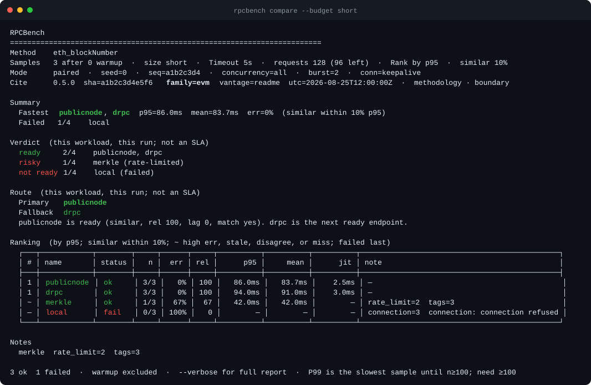
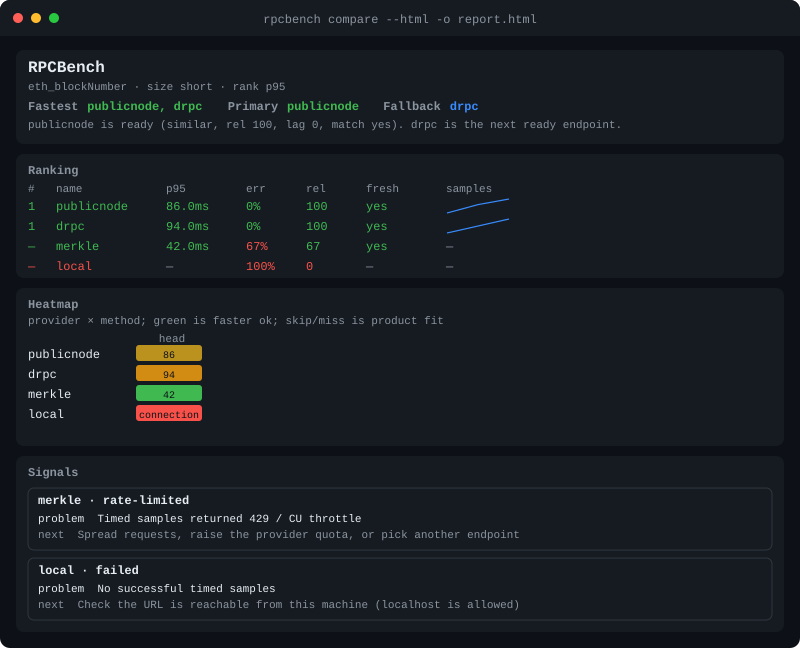

# RPCBench

**Which RPC is fastest for this workload — from this machine?**

A local CLI that compares your JSON-RPC / REST endpoints on latency, percentiles, errors, and freshness, then recommends a **primary** and **fallback**. Read-only by default. No accounts. No telemetry.

```bash
pip install rpcbench
rpcbench compare --endpoints endpoints.yaml
```

Supports EVM, Solana, Substrate, Cosmos, Aptos, Sui, NEAR, Starknet, Bitcoin, and TON.

| This is | This is not |
| --- | --- |
| A one-shot / CI **benchmark** from your vantage | A security scanner → [Nodeprobe](https://github.com/ehsanhajian/nodeprobe) |
| Honest stats with similar-band ranking | Always-on monitoring → [ValidatorPulse](https://github.com/ehsanhajian/ValidatorPulse) |
| Your endpoints (localhost allowed) | A public RPC catalog or SaaS |

Site: [ehsanhajian.github.io/RPCBench](https://ehsanhajian.github.io/RPCBench/) · PyPI: [rpcbench](https://pypi.org/project/rpcbench/) · Version: **0.6.1**

---

## Quick start

**1. Install** (Python 3.10+)

```bash
pip install rpcbench
rpcbench --version
```

**2. Endpoints file** (copy [endpoints.example.yaml](endpoints.example.yaml); keep keys local)

```yaml
endpoints:
  - name: a
    url: https://ethereum.publicnode.com
    family: evm
  - name: b
    url: https://eth.llamarpc.com
    family: evm
```

Compare **one family at a time** (`family:` on each row, or `--family evm`).

**3. Run**

```bash
rpcbench compare --endpoints endpoints.yaml
rpcbench compare --endpoints endpoints.yaml --workload wallet --html -o report.html
rpcbench compare --endpoints endpoints.yaml --out-dir out --ci --max-p95 500
```



---

## What a run tells you

| Output | Meaning |
| --- | --- |
| **Fastest** | Best P95 by default (co-winners within the similar-band) |
| **Verdict** | `ready` / `risky` / `not ready` for this workload, this run — not an SLA |
| **Route** | Suggested **primary** + **fallback** among ready endpoints |
| **Ranking** | Ordered table with `rel` (0–100 reliability for this run) |

Live progress: TTY table while sampling (`--plain` / `--ci` to disable). Optional UI: `--web` (or `rpcbench ui`); on a VPS use `--web-host 0.0.0.0`.

How numbers are computed: [docs/METHODOLOGY.md](docs/METHODOLOGY.md) · Product boundary: [docs/BOUNDARY.md](docs/BOUNDARY.md)

---

## Common workflows

```bash
# Named job mixes (extras depend on the job)
rpcbench compare --endpoints endpoints.yaml --workload general    # default if omitted
rpcbench compare --endpoints endpoints.yaml --workload wallet     # + simulate
rpcbench compare --endpoints endpoints.yaml --workload indexer    # + logs / archive / lookback
rpcbench compare --endpoints endpoints.yaml --method eth_blockNumber

# Sample size only (does not turn extras on)
rpcbench compare --endpoints endpoints.yaml --budget short|standard|long

# Reports
rpcbench compare --endpoints endpoints.yaml --json -o run.json
rpcbench compare --endpoints endpoints.yaml --html -o report.html
rpcbench compare --endpoints endpoints.yaml --md -o report.md
rpcbench compare --endpoints endpoints.yaml --out-dir out   # json + html + md + metrics.prom

# Compare two runs / merge regions
rpcbench diff old.json new.json
rpcbench merge eu.json us.json -o merged.json

# Live web UI
rpcbench ui --endpoints endpoints.yaml --web-port 8765
```

Lab flags (`--batch`, `--concurrency`, `--throughput`, `--shape`, `--websocket`, `--yellowstone`, …):

```bash
rpcbench compare --help-all
```

---

## Install options

<details>
<summary><strong>Docker</strong></summary>

```bash
docker pull ghcr.io/ehsanhajian/rpcbench:latest
docker run --rm -v "$PWD:/work" -w /work ghcr.io/ehsanhajian/rpcbench:latest \
  compare --endpoints endpoints.yaml --out-dir out --ci --max-p95 500
```

Images publish on `v*` tags. Local build: `docker build -t rpcbench .`

</details>

<details>
<summary><strong>GitHub Action</strong></summary>

```yaml
- uses: ehsanhajian/RPCBench@v0.6.1
  with:
    endpoints: endpoints.yaml
    budget: short
    max-p95: "500"
    max-error-rate: "0.05"
    output-dir: rpcbench-out
```

Fails the job when an SLO misses; uploads `rpcbench-report`. Full guide: [docs/CI.md](docs/CI.md)

</details>

<details>
<summary><strong>Dev install</strong></summary>

```bash
python3 -m venv .venv && source .venv/bin/activate
pip install -e ".[dev]"
```

</details>

---

## Report formats

| Flag | Result |
| --- | --- |
| *(default)* | Compact CLI (Summary → Verdict → Route → Ranking) |
| `--verbose` | Full dump (signals, coverage, timing, providers, …) |
| `--html -o FILE` | Standalone offline HTML (charts, heatmap, signals) |
| `--json` / `-o FILE` | Complete machine-readable payload |
| `--md` / `--csv` | Markdown table / flat CSV |
| `--prometheus` | Textfile metrics → [docs/PROMETHEUS.md](docs/PROMETHEUS.md) |
| `--out-dir DIR` | `report.json` + `report.html` + `report.md` + `metrics.prom` |



Grafana dashboard pack: [docs/GRAFANA.md](docs/GRAFANA.md)

---

## Essential flags

Happy path: `compare --endpoints FILE` → **general** mix, **short** budget.

| Flag | Default | Purpose |
| --- | --- | --- |
| `--endpoints` | required | YAML/JSON file or a single URL |
| `--family` | from file / `evm` | `evm`, `solana`, `substrate`, `cosmos`, `aptos`, `sui`, `near`, `starknet`, `bitcoin`, `ton`, `auto` |
| `--workload` | `general` | `wallet`, `indexer`, `trading`, `nft`, `tracing` |
| `--budget` | `short` | `short` / `standard` / `long` (sample size only) |
| `--rank-by` | `p95` | `p50`, `p95`, `p99`, `mean`, `rps` |
| `--ci` | off | Exit `1` on SLO miss (`--max-p95` / `--max-error-rate` / `--max-lag`) |
| `--web` | off | Local live UI (`--web-host`, `--web-port`) |
| `--out-dir` | | Write standard report bundle |

| `--budget` | Samples | Warmup | Timeout | Max duration |
| --- | --- | --- | --- | --- |
| `short` | 3 | 0 | 5s | 30s |
| `standard` | 10 | 1 | 10s | 600s |
| `long` | 50 | 2 | 15s | 1800s |

Everything else (burst, batch, shapes, WS, Yellowstone, transport, …): `rpcbench compare --help-all` and [docs/METHODOLOGY.md](docs/METHODOLOGY.md).

---

## Documentation

| Doc | Contents |
| --- | --- |
| [METHODOLOGY](docs/METHODOLOGY.md) | Paired compare, ranking, workloads, extras, JSON fields |
| [BOUNDARY](docs/BOUNDARY.md) | What RPCBench will never do (vs Nodeprobe / ValidatorPulse) |
| [CI](docs/CI.md) | Docker, Action, SLO exit codes |
| [PROMETHEUS](docs/PROMETHEUS.md) | Textfile scrape |
| [GRAFANA](docs/GRAFANA.md) | Dashboard import |

---

## Safety

- Read-only by default; writes need `--allow-writes`
- Kill switch: `RPCBENCH_DISABLED=1` or `~/.config/rpcbench/DISABLED`
- Secrets are redacted from reports
- Label the machine with `RPCBENCH_VANTAGE` (optional region/city/ASN); merge regions with `rpcbench merge`

---

## License

[MIT](LICENSE)
