# Medium article screenshots

Generated by `scripts/render_medium_shots.py`.

Raw PNG (best for Medium embeds):

## medium_01_cli-compare

Default compact CLI: Summary, Verdict, Route, Ranking

- Pages: `https://ehsanhajian.github.io/RPCBench/images/medium/medium_01_cli-compare.png`
- Raw: `https://raw.githubusercontent.com/ehsanhajian/RPCBench/main/docs/images/medium/medium_01_cli-compare.png`

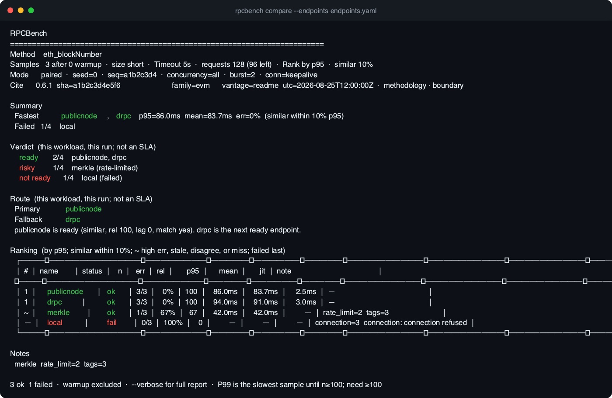

## medium_02_ranking-p95

P95 ranking with similar-band co-winners

- Pages: `https://ehsanhajian.github.io/RPCBench/images/medium/medium_02_ranking-p95.png`
- Raw: `https://raw.githubusercontent.com/ehsanhajian/RPCBench/main/docs/images/medium/medium_02_ranking-p95.png`

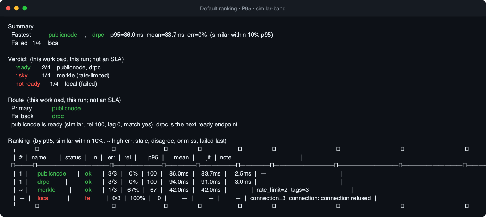

## medium_03_verdict-route

ready / risky / not ready + primary/fallback route

- Pages: `https://ehsanhajian.github.io/RPCBench/images/medium/medium_03_verdict-route.png`
- Raw: `https://raw.githubusercontent.com/ehsanhajian/RPCBench/main/docs/images/medium/medium_03_verdict-route.png`

## medium_04_workload-mix

Workload mix (wallet/indexer-style coverage)

- Pages: `https://ehsanhajian.github.io/RPCBench/images/medium/medium_04_workload-mix.png`
- Raw: `https://raw.githubusercontent.com/ehsanhajian/RPCBench/main/docs/images/medium/medium_04_workload-mix.png`

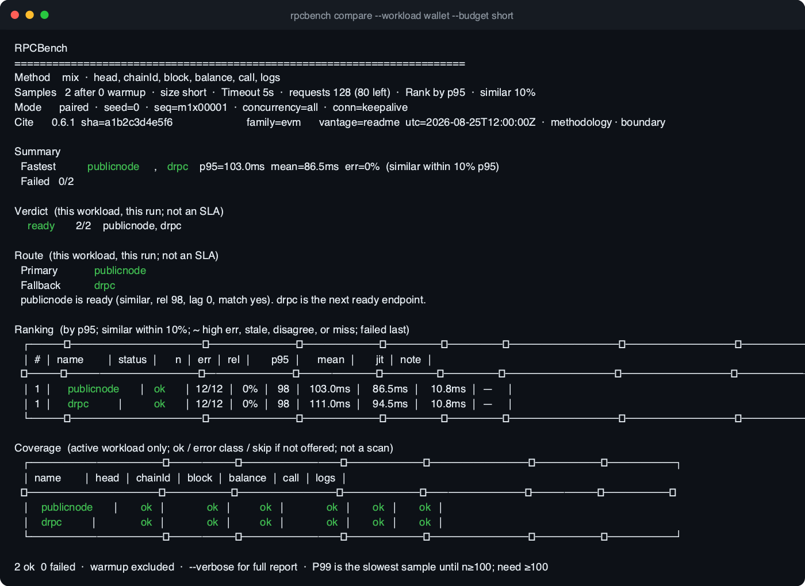

## medium_05_html-report

Standalone HTML report (offline charts)

- Pages: `https://ehsanhajian.github.io/RPCBench/images/medium/medium_05_html-report.png`
- Raw: `https://raw.githubusercontent.com/ehsanhajian/RPCBench/main/docs/images/medium/medium_05_html-report.png`

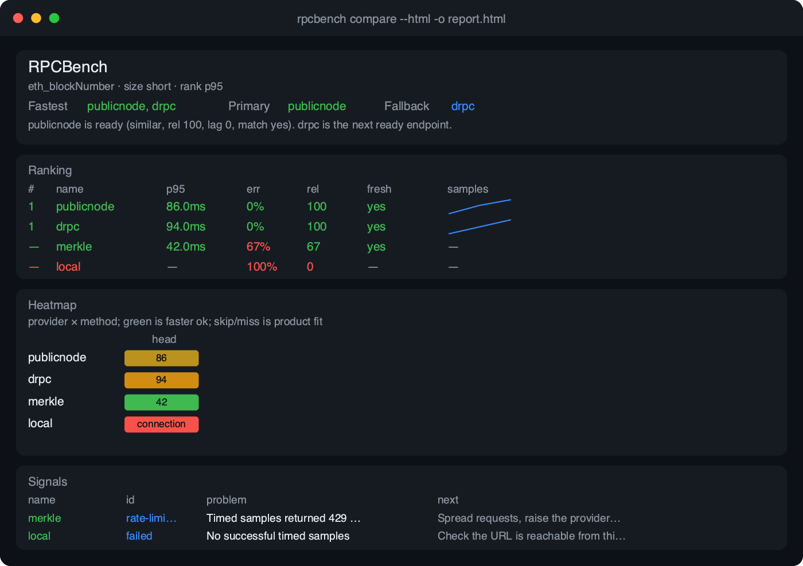

## medium_06_heatmap

Provider × method coverage heatmap

- Pages: `https://ehsanhajian.github.io/RPCBench/images/medium/medium_06_heatmap.png`
- Raw: `https://raw.githubusercontent.com/ehsanhajian/RPCBench/main/docs/images/medium/medium_06_heatmap.png`

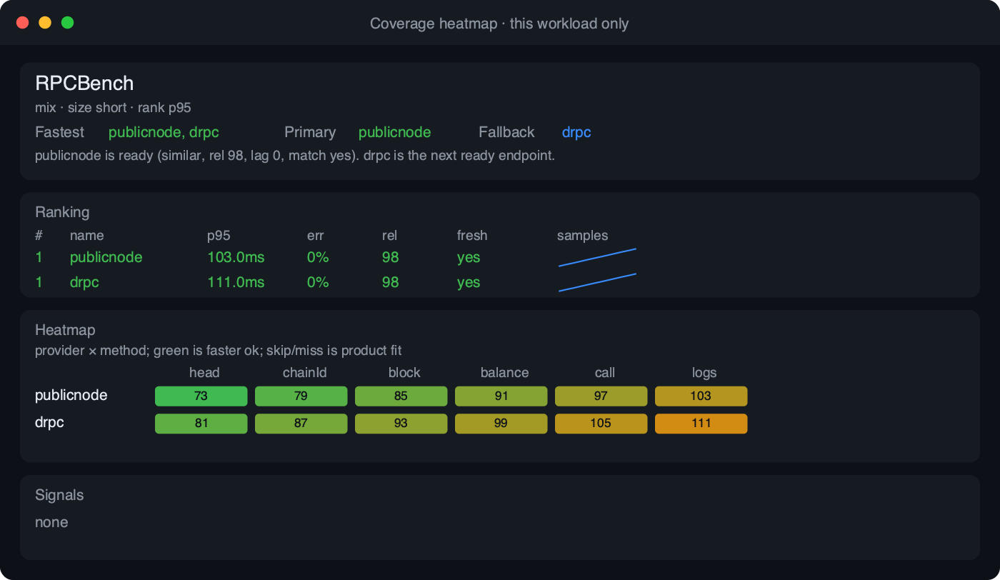

## medium_07_http-timing

HTTP timing split (handshake / server / payload)

- Pages: `https://ehsanhajian.github.io/RPCBench/images/medium/medium_07_http-timing.png`
- Raw: `https://raw.githubusercontent.com/ehsanhajian/RPCBench/main/docs/images/medium/medium_07_http-timing.png`

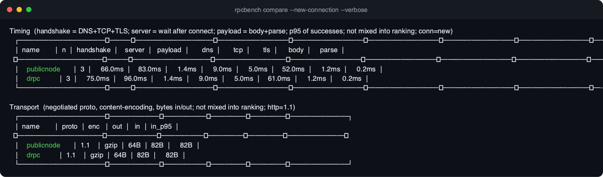

## medium_08_verbose-signals

Verbose reliability + signals

- Pages: `https://ehsanhajian.github.io/RPCBench/images/medium/medium_08_verbose-signals.png`
- Raw: `https://raw.githubusercontent.com/ehsanhajian/RPCBench/main/docs/images/medium/medium_08_verbose-signals.png`

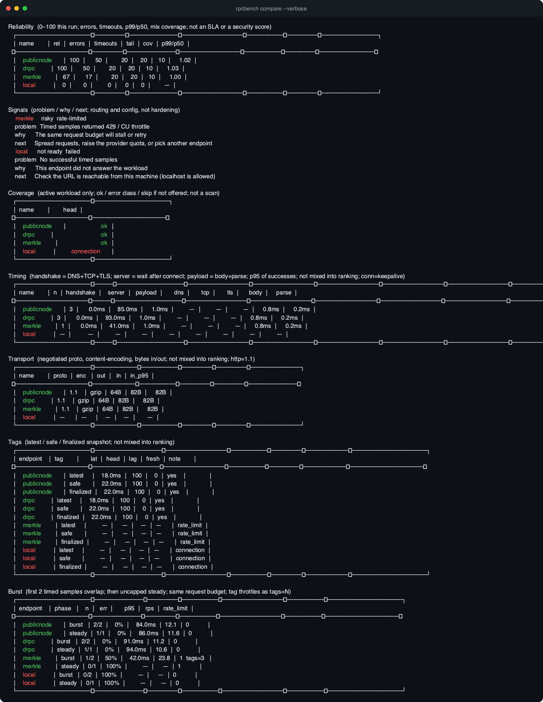

## medium_09_github-action

CI Action with SLO budgets

- Pages: `https://ehsanhajian.github.io/RPCBench/images/medium/medium_09_github-action.png`
- Raw: `https://raw.githubusercontent.com/ehsanhajian/RPCBench/main/docs/images/medium/medium_09_github-action.png`

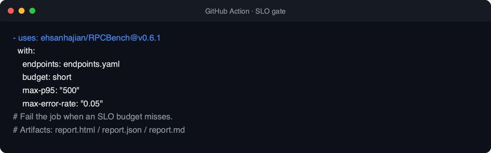

## medium_10_quickstart

Install and first compares

- Pages: `https://ehsanhajian.github.io/RPCBench/images/medium/medium_10_quickstart.png`
- Raw: `https://raw.githubusercontent.com/ehsanhajian/RPCBench/main/docs/images/medium/medium_10_quickstart.png`

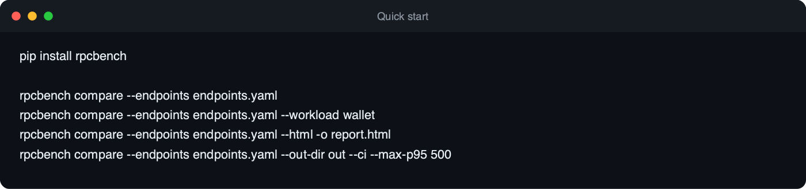

## medium_11_vantage-merge

Multi-region vantage + merge

- Pages: `https://ehsanhajian.github.io/RPCBench/images/medium/medium_11_vantage-merge.png`
- Raw: `https://raw.githubusercontent.com/ehsanhajian/RPCBench/main/docs/images/medium/medium_11_vantage-merge.png`

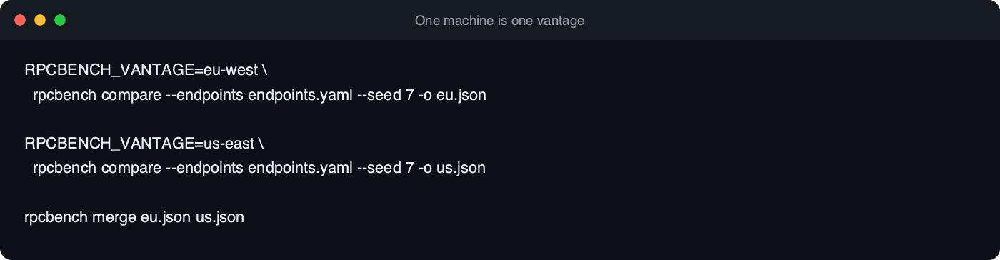

## medium_12_boundary

RPCBench vs Nodeprobe vs ValidatorPulse

- Pages: `https://ehsanhajian.github.io/RPCBench/images/medium/medium_12_boundary.png`
- Raw: `https://raw.githubusercontent.com/ehsanhajian/RPCBench/main/docs/images/medium/medium_12_boundary.png`

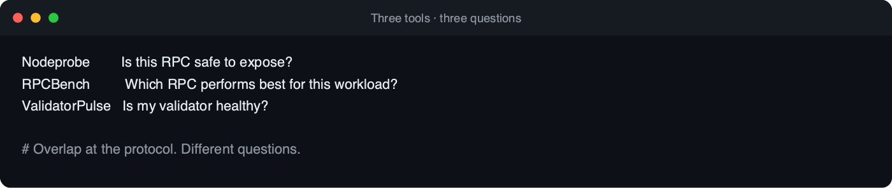
